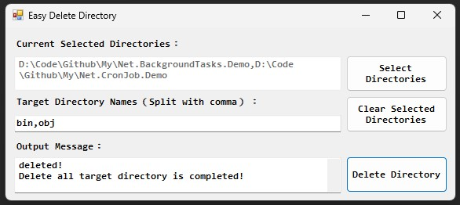

# EasyDeleteDirectory

Umm... Just because some directory are not pleasing to me :eyes:

## Overview

## How to use

1. Select main directory.
2. Typing you wanna delete directory names under the main directory (Split with comma).
3. Click "Delete Directory" button.

## License

MIT license
